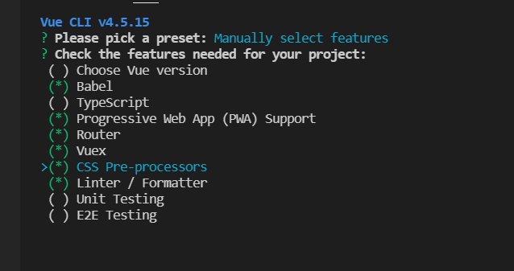
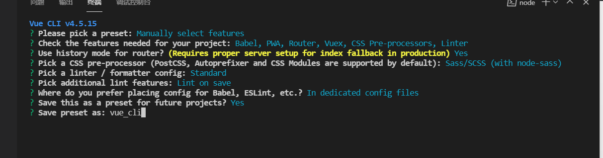
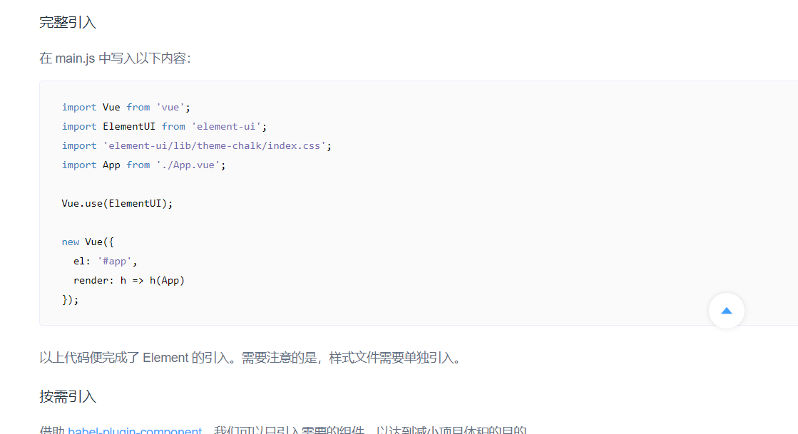

# note

## yarn

相比npm，优点：

+ 速度快

yarn是同步执行所有任务安装，提高性能

+ 离线模式
+ 安装版本同一 : 有一个锁文件记录
+ 更简洁的输出
+ 多注册来源处理
+ 更好的语义化

命令对比：

| npm                        | yarn                 |
| -------------------------- | -------------------- |
| npm install                | yarn                 |
| npm install react --save   | yarn add react       |
| npm uninstall react --save | yarn remove react    |
| npm install --save-dev     | yarn add react --dev |
| nppm update --save         | yarn upgrade         |


## Vue-cli4 脚手架搭建

好处：可以快速使用vue开发

步骤:

+ 安装nodejs

输入命令 `npm -v` `node -v`检测安装

+ 安装cnpm 或者 安装yarn

`npm install -g cnpm --registry=https://registry.npm.taobao.org`

`npm install -g yarn`

可以修改yarn的源 ：`yarn config set registry https://registry.npm.taobao.org -g`

+ 安装vue-cli脚手架构建工具

命令:`cnpm install -g @vue/cli`

检测是否安装成功:`vue -V`

+ 创建项目

输入命令:`vue create {project_name}` {project_name}换成自己项目名称

安装步骤中选择`Manually select features` 自己选择安装库，使用空格键选中选项








+ 启动项目

```shell
cd vue-cli
yarn serve
```


## element

单例的使用:

```html
<!DOCTYPE html>
<html>
<head>
  <meta charset="UTF-8">
  <!-- import CSS -->
  <link rel="stylesheet" href="https://unpkg.com/element-ui/lib/theme-chalk/index.css">
</head>
<body>
  <div id="app">
    <el-button>默认按钮</el-button>
    <el-button type="primary">主要按钮</el-button>
    <el-button type="success">成功按钮</el-button>
    <el-button type="info">信息按钮</el-button>
    <el-button type="warning">警告按钮</el-button>
    <el-button type="danger">危险按钮</el-button>
    <el-button @click="visible = true">Button</el-button>
    <el-dialog :visible.sync="visible" title="Hello world">
      <p>Try Element</p>
    </el-dialog>
  </div>
</body>
  <!-- import Vue before Element -->
  <script src="https://unpkg.com/vue/dist/vue.js"></script>
  <!-- import JavaScript -->
  <script src="https://unpkg.com/element-ui/lib/index.js"></script>
  <script>
    new Vue({
      el: '#app',
      data: function() {
        return { visible: false }
      }
    })
  </script>
</html>
```


## element-ui在脚手架中使用

+ cd到vue项目工程中

+ 安装：`npm i element-ui -S`

+ 使用： 参考: `[组件 | Element](https://element.eleme.io/#/zh-CN/component/quickstart)`




+ 引入后运行 `yarn run serve` 会报extra的错误

  解决: 新建 vue.config.js  写入：

  ```js
  module.exports = {
      lintOnSave: false
  }
  ```

  

+ 在 App.vue中就可以使用element-ui， 不过这种方式是全部引用


## element-ui按需引入

参考：  [组件 | Element](https://element.eleme.io/#/zh-CN/component/quickstart)

+ 安装：`cnpm install babel-plugin-component -D`

+ 在`babel.config.js`中添加:

  ```js
  "plugins": [
      [
        "component",
        {
          "libraryName": "element-ui",
          "styleLibraryName": "theme-chalk"
        }
      ]
    ]
  ```

+ 在main.js中按需求引入:

```js
import { Button, Select } from 'element-ui';

Vue.component(Button.name, Button);
Vue.component(Select.name, Select);
/* 或写为
 * Vue.use(Button)
 * Vue.use(Select)
 */
```


## vue路由的使用

分前端路由 和 后端路由

前端路由: key (url地址输入的值) -  value(component)


main.js中引入router

/router/index.js中填写url对应的组件

App.vue中引入:

```html
<div>
    <router-link to="/">去home组件</router-link> | 
    <router-link to="/about">去about组件</router-link>
    <router-view/>
</div>
```


## 左侧菜单栏的引入

添加文件: components/CommonAside.vue

在Main.vue中引入：

```html
<el-aside width="auto"><common-aside></common-aside></el-aside>

import CommonAside from '../components/CommonAside.vue';
// @ is an alias to /src

export default {
  name: 'Main',
  components: {
    CommonAside
  }
}

```

在main.js中引入 NavMenu的组件


## 使用vue的参数形式构建侧边栏数据

参考文件CommonAside.vue

添加click回调 通过this.$router.push方式进行路由跳转


## 头部栏的创建

参考CommonHeader.vue


## 点击收缩功能 跨组件传值

由`:collapse`属性控制

需要用到跨组件传值，新建一个tab.js:

```js
export default {
    state: {
        isCollapse: false
    },
    mutations:{
        collapseMenu(state) {
            state.isCollapse = !state.isCollapse
        }
    }
}
```

在index.js中引入该js:

```js
import Vue from 'vue'
import Vuex from 'vuex'
import tab from './tab'

Vue.use(Vuex)

export default new Vuex.Store({
  modules: {
    tab
  }
})

```

CommonAside.vue中添加:

```vue
isCollapse() {
return this.$store.state.tab.isCollapse;
}
```


添加click事件，点击后才收缩，CommonHeader.vue：

```vue
 @click="handleMenu"

    methods:{
        handleMenu() {
            this.$store.commit('collaspe');
        }
    }
```

折叠之后上面 通用后台管理系统不需要展示全部文字, CommonAside.vue:

```vue
  <h3 v-show="!isCollapse">通用后台管理系统</h3>
  <h3 v-show="isCollapse">后台</h3>
```


## home

懒加载:

router/index.js:

```js
const routes = [
  {
    path: '/',
    name: 'Main',
    component: Main,
    children:[
      {
        path:'/',
        name:'home',
        component:()=>import('@/views/Home/Home.vue')
      }
    ]
  },
  {
    path: '/about',
    name: 'About',
    // route level code-splitting
    // this generates a separate chunk (about.[hash].js) for this route
    // which is lazy-loaded when the route is visited.
    component: () => import(/* webpackChunkName: "about" */ '../views/About.vue')
  }
]
```


使用到了 栅格布局  卡片

引入css文件, Home.vue:

```vue
<style lang="scss" scoped>
@import "~@/assets/scss/home";
</style>
```


## 引入axios 异步库

安装:

`cnpm install axios --save`

--save 参数可以添加到package.json 的dependencies依赖中

main.js 中引入：

```js
import http from 'axios'
Vue.prototype.$http = http
```

Home.js中使用:

```js
    mounted() {
        this.$http
        .get('/user?ID=12345')
        .then(function (response) {
            console.log(response);
        })
        .catch(function (error) {
            console.log(error);
        });
    },
```


使用拦截器:

可以在请求前和相应做相应的事情， 参考： [axios中文文档|axios中文网 | axios (axios-js.com)](http://www.axios-js.com/zh-cn/docs/)

可以把一个公共的服务器错误，做一定的拦截处理。

新建: src/api/axios.js 和 src/config/index.js

对生产和开发环境进行配置:

 src/api/axios.js:

```js
// 二次封装axios 拦截器

import axios from 'axios'
import config from '../config/index'
// 设置配置 根据开发 和 生产环境不一样
const baseUrl = process.env.NODE_ENV === 'development' ? config.baseUrl.dev : config.baseUrl.pro

class HttpRequest {
    constructor(baseUrl) {
        this.baseUrl = baseUrl
    }
    getInsideConfig(){
        const config = {
            baseURL: this.baseUrl,
            header: {

            }
        }
        return config
    }

    interceptors(instance) {
        // 添加请求拦截器
        instance.interceptors.request.use(function (config) {
            // 在发送请求之前做些什么
            console.log("拦截处理请求");
            return config;
        }, function (error) {
            // 对请求错误做些什么
            return Promise.reject(error);
        });

        // 添加响应拦截器
        instance.interceptors.response.use(function (response) {
            console.log("数据响应");
            // 对响应数据做点什么
            return response;
        }, function (error) {
            console.log(error);
            // 对响应错误做点什么
            return Promise.reject(error);
        });
    }

    request(options) {
        // 请求
        // api/getList  /api/getHome
        const instance = axios.create()
        // 技巧 用户传递过来的option可以覆盖默认的option
        option = { ...(this.getInsideConfig), ...options }
        this.interceptors(instance);
        return instance(options)
    }
}

export default newHttpRequest(baseUrl)

```

 src/config/index.js:

```js
export default {
    title:'admin',
    baseUrl:{
        // 开发环境
        dev: '/api/',
        pro:''
    }
}
```


## home 中使用axios

home.vue:

```vue
import {getMenu} from '../../api/data'


 mounted() {
        getMenu().then((res)=>{
            console.log(res);
        })
    },
```


## mock.js

mock.js支持各种数据的随机生成, 我们可以拦截api然后生成随机数据

安装:

```shell
cnpm install mockjs --save
```


参考src/api/mock.js   src/api/mockServerData/home.js

Home.vue 中使用data.js 的 getHome方法，然后会被mock拦截，返回相应随机数据:

```vue
import { getHome } from '../../api/data'

    mounted() {
        getHome().then((res) => {
            console.log(res)
        })
    },
```

main.js中引入 mock, 并且判断在开发环境中才会使用mock去生成随机数据

```js
if (process.env.NODE_ENV === 'development') require('@/api/mock')
```


## echarts

用法参考 

+ charts.html

+ 官网 [Handbook - Apache ECharts](https://echarts.apache.org/handbook/zh/get-started/)

安装：

```shell
cnpm install echarts -S
```


home.vue中使用图表，填充好数据Home.vue：

```vue
<el-card shadow="hover" style="height: 280px">
	<div style="height:100%" ref="echart"></div>
</el-card>
```


## 把echarts封装成组件

参考 Echarts.vue

在Home.vue引用组件:

```vue
<echart :chartData="echartData.order" style="height: 280px"></echart>
<echart :chartData="echartData.user" style="height: 240px"></echart>
<echart
        :chartData="echartData.video"
        style="height: 240px"
        :isAxisChart="false"
></echart>


import Echart from "@/components/ECharts.vue";

components: {
Echart,
},
```


## 引入标签栏

main.vue:

```vue
      <common-tag></common-tag>
import CommonTag from "../components/CommonTag.vue"
  components: {
    CommonAside,
    CommonHeader,
    CommonTag
  }
```


main.js:

```
Vue.use(Tag)
```

tab.js:

```js
        tabList:[
            {
                path:'/',
                name:"home",
                label:'首页',
                icon:'home'
            }
        ]
```


CommonTag.vue:

```vue
<template>
    <div class="tabs">
        <el-tag
            v-for="tag in tags"
            :key="tag.name"
            size="small"
            :closable="tag.name !== 'home'"
            :effect="$router.name === tag.name ? 'dark' : 'plain'"
        >{{ tag.label }}</el-tag>
    </div>
</template>

<script>
import { mapState } from "vuex";
export default {
    computed:{
        ...mapState({
            tags: (state) => state.tab.tabList,
        })
    }
};
</script>

<style lang="scss">
    .tabs {
        padding: 20px;
        .el-tag{
            margin-right:15px;
            cursor: pointer;
        }
    }
</style>
```


## 面包屑

router/index.js添加路由 

```js
      {
        path:'/mall',
        name:'mall',
        component:() => import('@/views/Mall/Mall')
      },
      {
        path:'/user',
        name:'user',
        component:() => import('@/views/User/User')
      }
```

添加Mall/Mall.vue 和 User/User.vue


点击切换后，要修改对应的事件

tab.js:

```js
currentMenu: null,
    
 selectMenu(state, val) {
        val.name === 'home' ? (state.currentMenu = null) : state.currentMenu = val
    }   
```

CommonAside.vue：

```vue
this.$store.commit('selectMenu', item);
```

CommonHeader.vue修改之前写死的首页

`<h3 style="color:#fff">首页</h3>` 删掉

修改为：

```vue
<el-breadcrumb>
    <el-breadcrumb-item :to="{ path: '/' }">首页</el-breadcrumb-item>
    <el-breadcrumb-item :to="current.path" v-if="current">
        {{current.label}}
    </el-breadcrumb-item>
</el-breadcrumb>
```

```vue
import {mapState} from 'vuex'
computed: {
      ...mapState({
        current:state=>state.tab.currentMenu
      })
    }
```


main.js中引入面包屑

```js
Vue.use(Breadcrumb)
Vue.use(BreadcrumbItem)
```


## 解决路由重复报错

/router/index.js:

```js
const originPush = VueRouter.prototype.push
VueRouter.prototype.push = function push(location) {
  return originPush.call(this, location).catch(err=>err)
}
```


## 导航栏新增和切换

/store/tab.js

```js
if (val.name === 'home') {
    state.currentMenu = null
} else {
    state.currentMenu = val
    // 新增tabList
    let result = state.tabList.findIndex(item=>item.name === val.name)
    result === -1 ? state.tabList.push(val) : ''
}
```


点击标签跳转:

```vue
@click="changeMenu(tag)"

methods: {
    changeMenu(item) {
        this.$router.push({name:item.name})
        this.$store.commit("selectMenu", item)
    }
},
```


## 导航tag的删除

/store/tab.js:

```js
        closeTag(state, val) {
            let result = state.tabList.findIndex(item => item.name === val.name)
            state.tabList.splice(result, 1)
        }
```

CommonTag.vue:

```vue
...mapMutations({
            close: 'closeTag'
        }),
```

